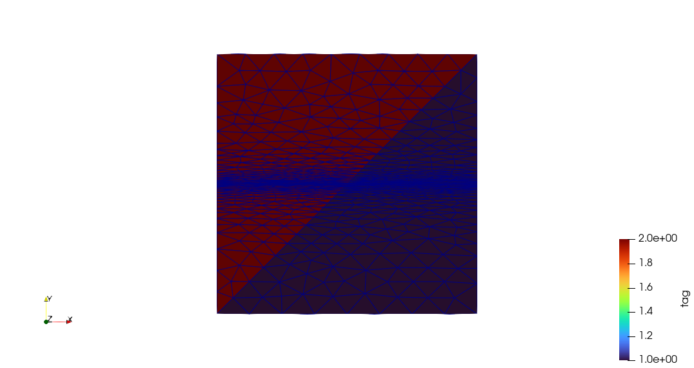
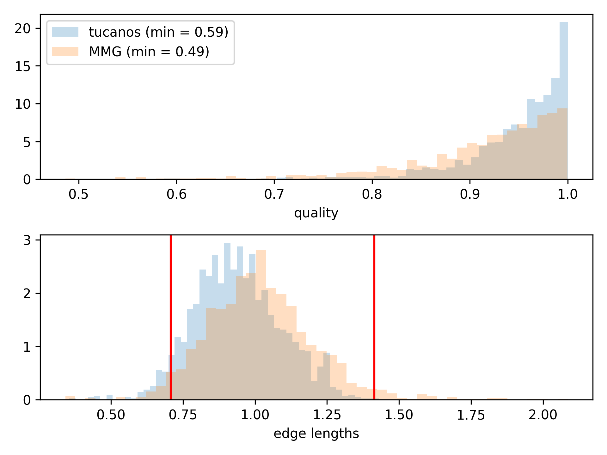
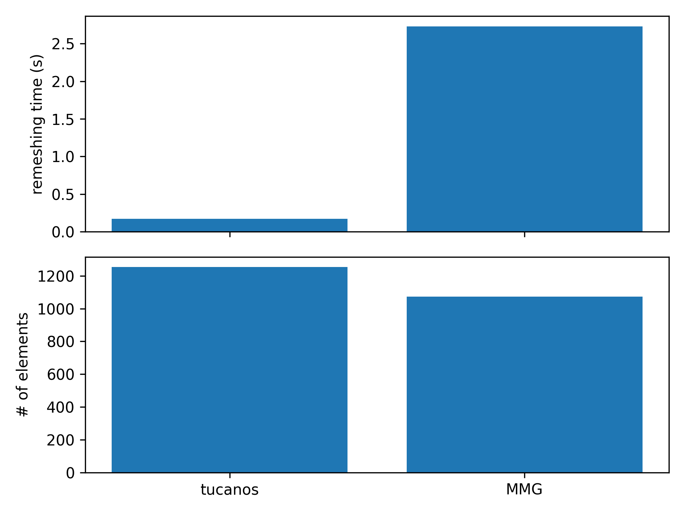

# Anisotropic remeshing in a square

## Configuration

The geometry is an unit square with two different tags above and below the diagonal, so there is an internal surface.

The target anisotropic cell size are 
- $h_x = 0.5$
- $h_y =  h_0 + 2 (0.1 - h_0)|y - 0.5|$ with $h_0 = 0.001$



## Start mesh

The initial mesh only contains two triangles. 4 iterations are performed to avoid differences with the metric interpolation.

As the quality of the initial mesh is quite high, one should allow a decrease of the mesh quality during split and collapse loops, e.g. by setting
```python
remesher.remesh(
    split_min_q_rel=0.5,
    collapse_min_q_rel=0.5,
)
```

## Results after 5 iterations




